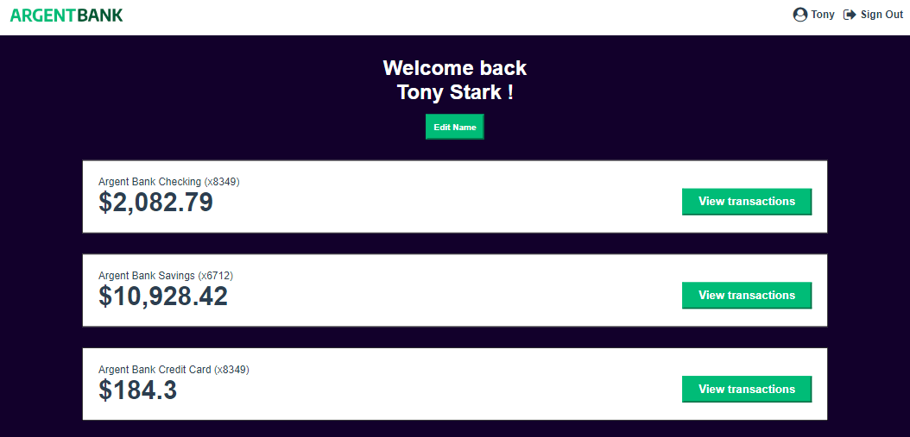

# ArgentBank

## Utilisez une API pour un compte utilisateur bancaire avec React

### 📚 Présentation

Ce projet a pour objectif le développement d’une application bancaire en utilisant React et Redux pour créer une expérience utilisateur dynamique et réactive.  
Il vise à intégrer le front-end avec le back-end via des appels API.  
Il s'agit d'écrire des appels à l'API REST pour connecter les deux parties de l'application, assurant une communication fluide entre le client et le serveur.  
L'interface utilisateur responsive est développée avec React  
Redux permet de gérer les données de l'application afin de maintenir un état global cohérent à travers l'application.  
L'API est modélisée avec Swagger et les données sont stockées sur MongoDB.  
Ce projet possède un fichier Swagger proposant une solution pour l'intégration future de la gestion des transactions.
L'utilisateur pourra :  

- visualiser toutes ses transactions pour le mois en cours, groupées par compte ;  
- visualiser les détails d'une transaction ;  
- ajouter, modifier ou supprimer des informations sur une transaction.  

### 💡 Outils et technos

### 🔨 Installation du projet

Le projet utilise NodeJS et `pnpm` 

➡ Cloner l'API : [Repository de l'API](https://github.com/OpenClassrooms-Student-Center/Project-10-Bank-API) 
➡ Cloner le projet 
➡ Ouvrir le dossier dans VSCode (ou tout autre IDE) 
➡ Installer les node-modules : `pnpm install` 

### 🚀 Lancement du projet

➡ Lancer l'API : Suivre les instructions du README lié à l'API. 
➡ Lancer l'application : `pnpm run dev` 

### ⚙ Contraintes techniques

➡ Utiliser Redux pour gérer le state de l'ensemble de l'application. 
➡ L'authentification doit être effectuée à l'aide d'un token JWT. 
➡ L'utilisateur ne doit pas pouvoir accéder à la page de profil s'il n'est pas connecté. 
➡ L'utilisateur peut mettre à jour son prénom et/ou son nom. 

### 🏆 Compétences évaluées

➡ S'authentifier à une API 
➡ Implémenter un gestionnaire d'état dans une application React 
➡ Intéragir avec une API 
➡ Modéliser une API 

# English version

# ArgentBank

## Use an API for a user bank account with React

### 📚 Overview

This project aims to develop a banking application using React and Redux to create a dynamic and responsive user experience.  
It aims to integrate the front-end with the back-end via API calls.  
The application writes REST API calls to connect the two parts, ensuring smooth communication between client and server.  
The responsive user interface is developed with React.  
Redux manages application data to maintain consistent global state throughout the application.  
The API is modeled using Swagger, and data is stored in MongoDB.  
Users authenticate using a JWT token.  
This project has a Swagger file proposing a solution for future integration of transaction management.  
Users will be able to: 

- View all their transactions for the current month, grouped by account; 
- View details of a transaction; 
- Add, modify, or delete transaction information. 

### 💡 Tools and Technologies

### 🔨 Project Setup

The project uses NodeJS and `pnpm`. 

➡ Clone the API: [API Repository](https://github.com/OpenClassrooms-Student-Center/Project-10-Bank-API) 
➡ Clone the project 
➡ Open the folder in VSCode (or any other IDE) 
➡ Install node modules: `pnpm install` 

### 🚀 Running the Project

➡ Launch the API: Follow the instructions in the API's README. 
➡ Launch the application: `pnpm run dev` 

### ⚙ Technical Constraints

➡ Use Redux to manage the state of the entire application. 
➡ Authentication must be done using a JWT token. 
➡ Users should not be able to access the profile page if they are not logged in. 
➡ Users can update their first name and/or last name. 

### 🏆 Skills Evaluated

➡ Authenticate to an API 
➡ Implement a state manager in a React application 
➡ Interact with an API 
➡ Model an API 
